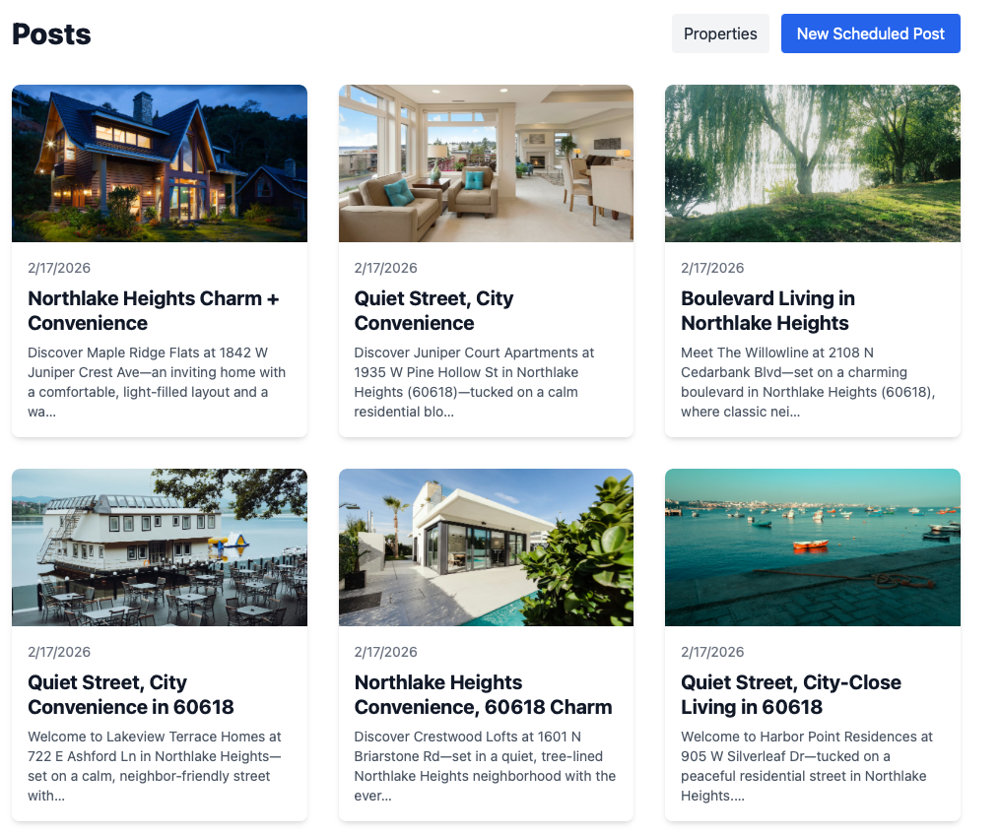
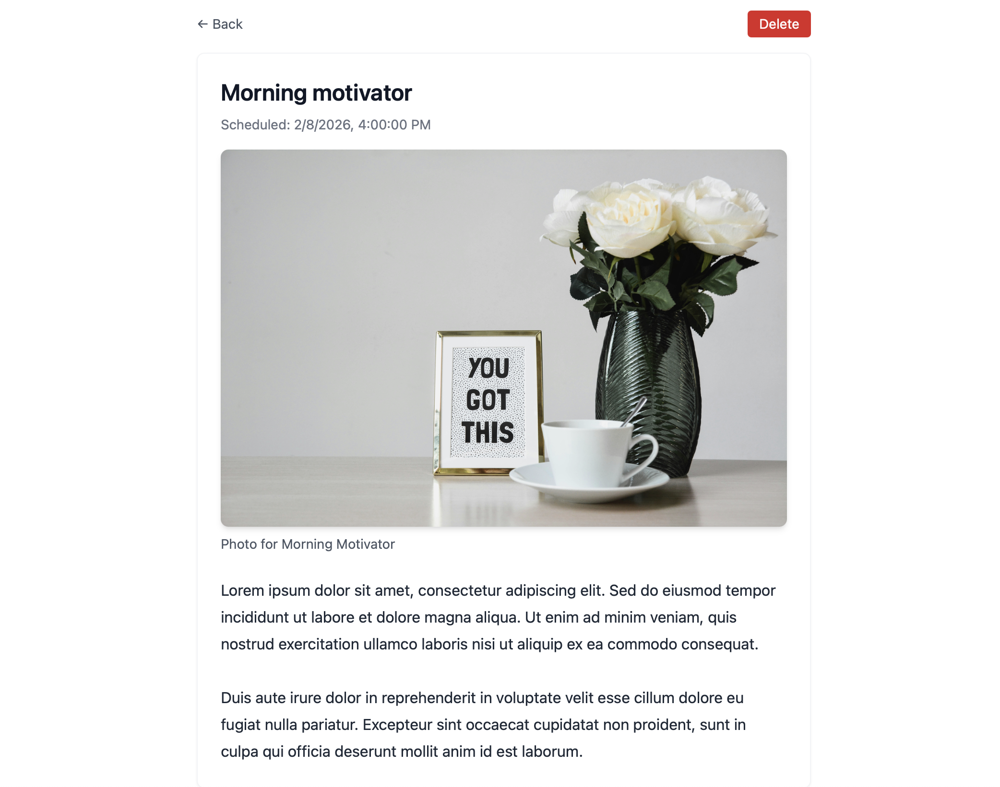

# Social Media Post Scheduler

This repository contains two folders: `backend` (Rails API) and `frontend` (Vite + React).

## Quick setup

1. Start the backend (Rails API)

```bash
# in one terminal
cd backend
bundle install
bin/rails db:create db:migrate db:seed
bin/rails server -p 3000
```

2. Start the frontend (Vite)

```bash
# in a second terminal
cd frontend
npm install
npm run dev
```

## Notes

- Rails API defaults to `http://localhost:3000`.
- Vite dev server commonly runs at `http://localhost:5173` — open that URL to view the SPA.

## Troubleshooting

- If `npm install` errors for certain packages, try `npm cache clean --force` and retry, or run `npm install --registry=https://registry.npmjs.org/`.
- For gems that fail to build, ensure system-level build tools and libraries are installed (e.g. `build-essential`, libxml2, icu, cmake on macOS use Homebrew packages).

## Screenshots

Below are screenshots of the current UI/layout:




